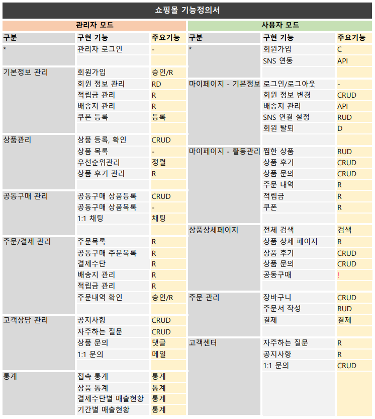

# JAVA Spring) 1인가구를 위한 쇼핑몰 Uno más 개발일지 1 - 주제 선정과 역할 분배
* 작성일 : 2022.04.14
* 작성자 : 황유진
* 팀원 : 김진영, 박승지, 반현빈, 오성은, 오은현, 윤정환, 황유진   

# 개발환경
* MacBook Air (M1, 2020)
* OpenJDK 11
* Spring Tool Suite 4.14.0
* Tomcat 8.5
* MySQL Workbench 8.0.19   

# 기간
* 2022.4.13 ~ 2022.5.20   

# 주제
* 웹 백엔드 수업 중 마지막 과제로 팀 프로젝트를 진행하게 되었다.
* 조건은 `Spring` 기반으로 웹 사이트를 제작하는 것이다.
* 총 팀원은 7명이며, 우리 팀은 `1인 가구를 위한 쇼핑몰`을 주제로 정했다.   

# 진행상황
## 역할 분배
* 팀장 : 황유진
* 부팀장 : 오성은
* 서기 : 반현빈

## 마감 기한
* 5/20 으로 정했다.
* 6월 첫째주에 발표가 예정되어 있지만 발표 전에 강사님들께 최종 점검을 받을 기간이 필요하다고 판단되어서 발표일 보다는 조금 일찍 완성하는 것을 목표로 세웠다.

## 주제 선정
* 쇼핑몰과 영화 예매 사이트가 제시되었다. 
* 그 중에서 `1인 가구를 위한 쇼핑몰`로 최종 결정되었다.

## 사이트 이름 선정
* 싱글마켓, 혼자 잘 먹고 잘 사는 방법, 피투피(Person to Person), One Together, Uno más(스페인어로 하나 더) 등이 제시되었다.
* `Uno más`가 최종 선정되었다.

## 팀 이름 선정
* 4월에 시작해서 `April`이 제시되었다. 이 외에 추가적으로 제시된 이름이 아직 없어서 아이디어가 더 나오면 의견 조율해서 최종 결정할 예정이다.

## 변수명 및 코드 작성 규칙
* 변수명은 기본적으로 카멜 표기법(`codeCode`) 형식으로 쓰되, `CSS` 적용을 위한 선택자를 지정할 때엔 스네이크 표기법(`code_code`)을 사용하기로 했다.
* 이렇게 정한 이유는 `CSS` 파일에서 카멜 표기법으로 선택자를 작성했을 때엔 알아보기 어려웠다는 의견이 있었기 때문이다.
* 추가로 무의미한 변수명과 지나친 축약어로 만든 변수명은 사용은 하지 않기로 했다. 만약 정말 변수명을 못 정하겠다면 [https://www.curioustore.com/#!/](https://www.curioustore.com/#!/) 여기를 참고할 것
* 코드 작성 시 다른 팀원이 보다 쉽게 알아볼 수 있게 주석으로 작성의도를 작성하기로 했다.

## GitHub Repository 생성 및 개발일지 작성
* 형상관리를 위해 `GitHub`을 사용하기로 했다.
* 추후 프로젝트 진행 결과 정리 및 발표 자료를 만들 때 참고하기 위해서 기능을 구현할 때마다 개발 일지를 작성하기로 했다.
* 본인이 구현한 내용은 꼭 정확하게 그때그때 기록해 놓기!!!

## TDD 주도 개발
* 수업시간에 TDD 코드 작성 방법을 배웠기 때문에 기능 구현 전에 테스트 코드 작성을 통해 구현하고자 하는 기능의 테스트 후 본 코드를 작성할 것이다.

## 필요 기능 정의서
* 제작자 : 박승지

* 무료로 사용할 수 있는 쇼핑몰 템플릿을 이 기능 명세서에 맞게 변형해서 사용하기로 했다.
* [https://freemiumdownload.com/demo?theme=fashi](https://freemiumdownload.com/demo?theme=fashi)
* [https://technext.github.io/ogani/index.html](https://technext.github.io/ogani/index.html)

## DB 테이블 설계
* 설계자 : 오성은, 황유진
* 4/17 까지 설계를 마친 후 4/17 오후 10시에 모든 팀원들이 온라인 미팅으로 모여서 검토하고 최종 결정할 것이다.
* 때문에 회원가입과 게시판 등 DB 테이블이 필요한 기능은 DB 테이블이 최종 결정되면 진행하고 그 외의 기능들은 지금부터 진행하기로 했다.

## 1차 구현 기능 분배
* 목표 : 5/22 까지 구현 후 5/22 저녁에 리뷰
* 메인 페이지 디자인 : 반현빈, 박승지
* 회원가입/로그인/로그아웃/탈퇴 기능 구현 : 오은현, 오성은
* 메인 페이지에서 상품 상세 페이지 연결 및 상세 페이지의 세부 기능 구현(수량 증감, 상품 설명 디스플레이, 후기/문의 게시판) : 황유진, 박승지
* 고객센터 페이지의 게시판 구현(공지사항, 자주하는 질문, 1:1 문의) : 김진영, 윤정환
* 글쓰기 페이지 디자인 : 윤정환
* 헤더와 푸터 구성 및 클릭 시 해당 페이지로 연결 : 반현빈   

# 마감까지
* `D-36`
