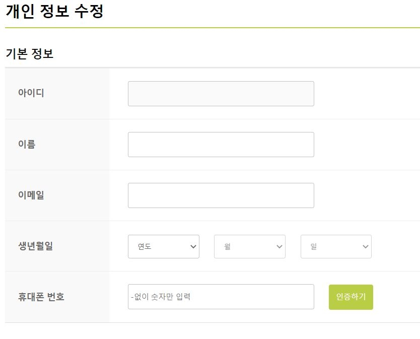
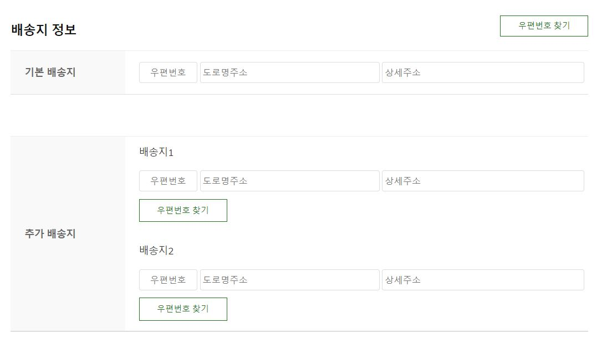
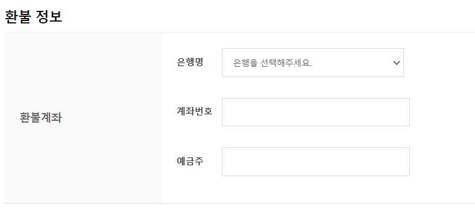
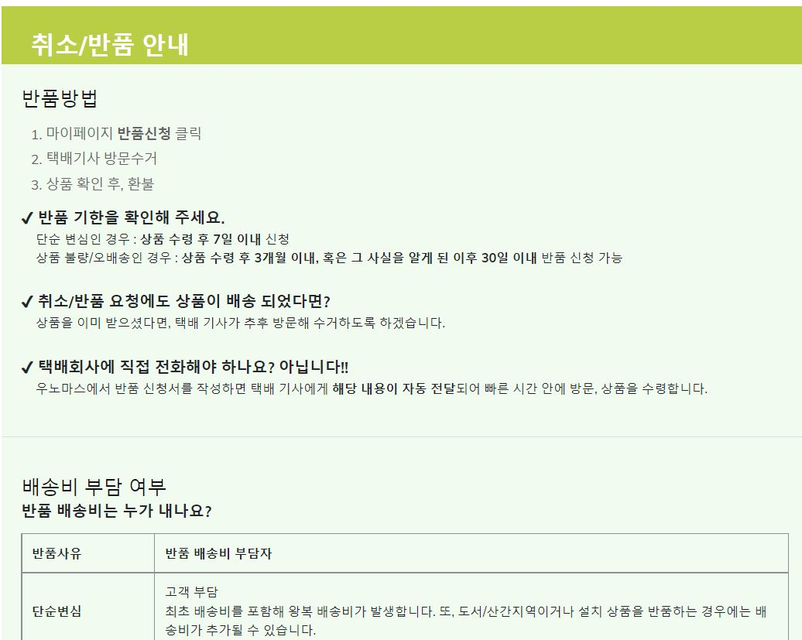

# JAVA Spring) 1인가구를 위한 쇼핑몰 Uno más 개발일지 12 - 회원정보 수정, 취소/반품안내 페이지 제작

* 작성일 : 2022.05.03
* 작성자 : 오은현
* 팀원 : 김진영, 박승지, 반현빈, 오성은, 오은현, 윤정환, 황유진
* GitHub Repository : [https://github.com/miro7923/Uno-Mas](https://github.com/miro7923/Uno-Mas)<br><br><br>

# 개발환경
* Window10
* OpenJDK 8
* Spring Tool Suite 4.10.0
* Spring framework 4.3.1.RELEASE
* Tomcat 8.5
* MySQL Workbench 8.0.19<br><br><br>

# 기간
* 2022.4.13 ~ 2022.5.20<br><br><br>

# 주제
* 웹 백엔드 수업 중 마지막 과제로 팀 프로젝트를 진행하게 되었다.
* 조건은 `Spring` 기반으로 웹 사이트를 제작하는 것이다.
* 총 팀원은 7명이며, 우리 팀은 `1인 가구를 위한 쇼핑몰`을 주제로 정했다.
* 프로젝트 이름으로 정해진 `Uno más`는 스페인어로 `하나 더`라는 뜻이다. <br><br><br>

# 진행상황 1 - 회원정보 수정 페이지 frontend
## updateMyInfo.jsp
* 사용자의 회원정보 확인페이지에서 수정페이지로 넘어왔을 때 보여지는 페이지를 구현했다.
  
## 회원정보 수정 페이지
### 기본정보 수정
<p align="center"></p>
* 회원정보 확인 페이지와 큰 틀은 유사하다.
* 이 페이지의 기본정보에서는 이름, 이메일, 생년월일, 휴대폰 번호를 수정할 수 있다
* 아이디는 변경을 하지못하게 `disabled` 처리를 하였다.
* 휴대폰 번호 변경시 다시 인증을 하도록 만들었다.
<br><br>

### 배송지정보 수정
<p align="center"></p> 
* 배송지는 최대 3개까지 가능하게 만들었다.
* 기본 배송지 1개와 추가 배송지 2개까지 저장이 가능하다.
* 우편API는 다음 우편번호API의 팝업창을 이용해서 구현했다.
<br>

```jsp
<div style="text-align: right;">
				<h3 style="float: left;">배송지 정보</h3>
					<input type="button" name="postalcode" value="우편번호 찾기" id="postal_btn" onclick="execDaumPostcode('0')">
				</div>
				<table class="table_info">
					<tr>
						<th>기본 배송지</th>
						<td style="line-height: 25px;">
							<input type="text" id="postalcode" name="postalcode" placeholder="우편번호">
							<input type="text" id="roadaddr" name="roadaddr" placeholder="도로명주소">
							<span id="guide" style="color:#999;display:none"></span>
							<input type="text" id="detailaddr" name="detailaddr" placeholder="상세주소">
						</td>
					</tr>
				</table>
				<table class="table_info">
					<tr>
						<th>추가 배송지</th>
						<td style="line-height: 25px;">
							<label>배송지1</label><br>
							<input type="text" id="postalcode1" name="postalcode1" placeholder="우편번호">
							<input type="text" id="roadaddr1" name="roadaddr" placeholder="도로명주소">
							<span id="guide" style="color:#999;display:none"></span>
							<input type="text" id="detailaddr" name="detailaddr" placeholder="상세주소">
							<input type="button" name="postalcode" value="우편번호 찾기" id="postal_btn2" onclick="execDaumPostcode('1')">
							<br><br>
							<label>배송지2</label><br>
							<input type="text" id="postalcode2" name="postalcode2" placeholder="우편번호">
							<input type="text" id="roadaddr2" name="roadaddr" placeholder="도로명주소">
							<span id="guide" style="color:#999;display:none"></span>
							<input type="text" id="detailaddr" name="detailaddr" placeholder="상세주소">
							<input type="button" name="postalcode" value="우편번호 찾기" id="postal_btn2" onclick="execDaumPostcode('2')">
						</td>
					</tr>
				</table>
```

<br><br>

### 환불정보 수정
<p align="center"></p> 
* 목록의 형태로 은행명을 선택할 수 있고, 계좌번호와 예금주를 입력할 수 있게 만들었다.
<br><br>

# 진행상황 2 - 취소/반품안내 페이지 frontend
## returnGuide.jsp
* `우노마스`는 식료품 쇼핑몰이기 때문에 취소/반품에 대한 정보를 얻을 수 있는 페이지를 구현했다.
* `쿠팡`을 참고했다.
  
 ## 취소/반품안내 페이지 
<p align="center"></p> 
* 반품방법을 간략히 설명했으며, 배송비 부담여부, 취소방법, 환불시점 등 가독성을 편하게 하기위해 표를 이용했다.

# 구현시 어려웠던 점
* 회원정보 수정시 일반 우편API는 사용이 간단하나 3개를 동시에 한 화면에 보여주는 예시는 없어서 구현하는데 시간이 꽤 소요됐다. 
<br>
* 하지만 같은 파트 팀원의 도움으로 구현하는데 성공했다. 역시 혼자보단 같이하는게 해결속도를 높이는데 도움이 되는 것 같다.
<br>
* 입력칸이 많다보니 위치를 잡는게 생각보다 어려웠다. 갑자기 튀는 칸들도 생기고 css적용도 안되고 그랬다. 그래도 구글링으로 계속 찾으며 수정해나갔다.

# 마감까지
`D-17`

 
